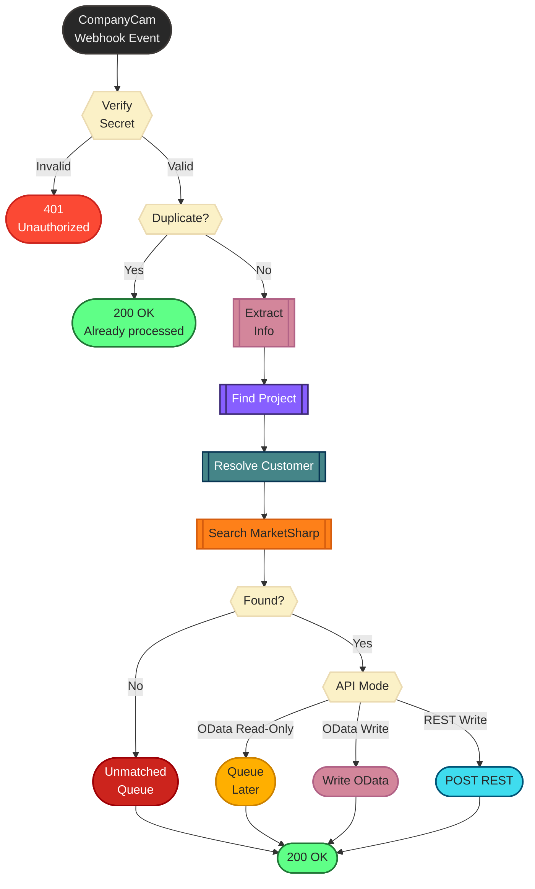
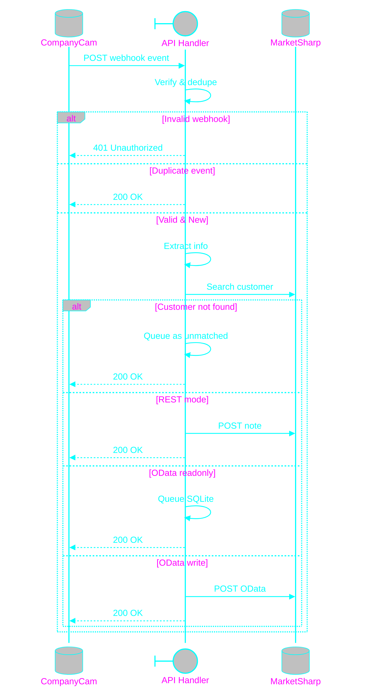
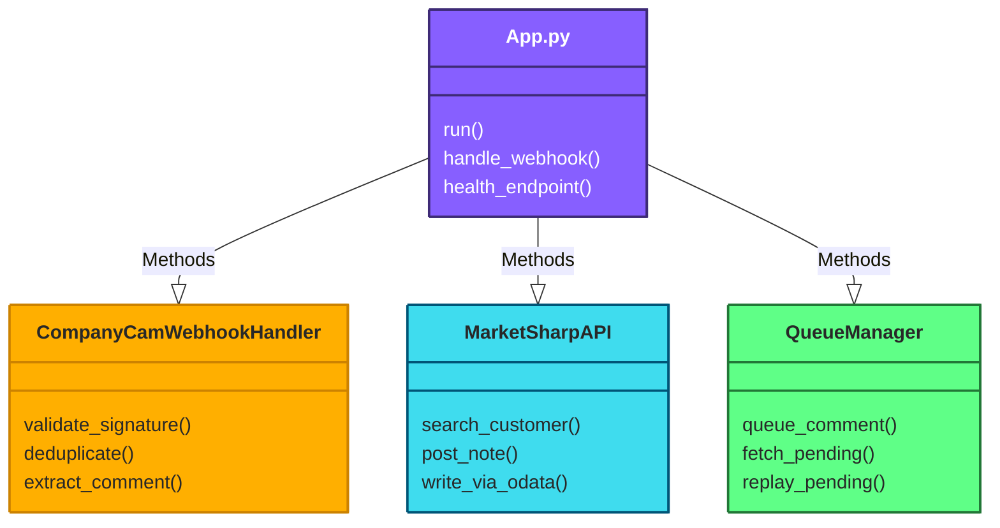

# 🖥️⚡️👾⚡️API Handler⚡️👾⚡️🖥️


### API software developed for the purpose of integrating information across multiple platforms as needed for the desired organization.
#### CompanyCam to MarketSharp Comment Sync

## Prerequisites
- Python 3.8+ (recommended)
- [pip](https://pip.pypa.io/)
- [Playwright](https://playwright.dev/python/), if using the UI poster worker
- OS-specific dependencies (e.g., Chromium, see Playwright install docs)

This application handles webhook events from CompanyCam and automatically posts comments to the corresponding customer account in MarketSharp.

## Table of Contents
- [Architecture Overview](#architecture-overview)
- [Setup](#setup)
- [How It Works](#how-it-works)
- [Queue UI Poster Worker](#queue-ui-poster-worker-logged-in-browser-bridge)
- [Contact Mapping Workflow](#contact-mapping-workflow)
- [Security Hardening](#security-hardening)
- [API Endpoints](#api-endpoints)
- [Deployment](#deployment)
- [CompanyCam Webhook Configuration](#companycam-webhook-configuration)
- [Home Server Deployment Notes](#home-server-deployment-notes)
- [macOS Production Setup](#macos-production-setup-recommended)
- [Operations Runbook](#operations-runbook)
- [Troubleshooting](#troubleshooting)
- [Error Handling](#error-handling)
- [Contributing](#contributing)
- [License](#license)

## Architecture Overview

- CompanyCam delivers `comment.*` events to `/webhook/companycam`
- The service validates webhook authenticity (token or signature)
- Duplicate deliveries are ignored via a local SQLite dedupe store
- Matching customer is resolved by name in MarketSharp
- If MarketSharp is read-only (OData mode), comments are stored in a local pending queue
- If MarketSharp write API is enabled (REST mode), comment text is posted as a customer note

| `MARKETSHARP_MODE` | Description | Behavior |
|---|---|---|
| `auto` (default) | Detects best mode | Automatic selection |
| `rest_write` | Uses MarketSharp REST write API | Posts notes in real-time |
| `odata_readonly` | OData only, cannot write directly | Queues comments locally |
| `odata_write` | Writes via OData `Notes` entity | Posts where possible |

---

## API Flowchart


## Process Sequencing


## Class Diagram


## Setup

## Quick Start

```bash
git clone https://github.com/sweetrellish/api-handlers-spicer.git
cd api-handlers-spicer
pip install -r requirements.txt
cp .env.example .env
# Fill in your secrets in .env
python app.py
```

### 1. Install Dependencies

```bash
pip install -r requirements.txt
```

### 2. Configure Environment Variables

Copy `.env.example` to `.env` and fill in your credentials:

```bash
cp .env.example .env
```

Edit `.env` with your actual credentials:

- `COMPANYCAM_WEBHOOK_TOKEN`: Your CompanyCam access token
- `COMPANYCAM_WEBHOOK_SECRET`: Shared secret for webhook verification
- `MARKETSHARP_MODE`: `auto` (default), `odata_readonly`, `odata_write`, or `rest_write`
- `MARKETSHARP_COMPANY_ID`: Company ID from MarketSharp API Maintenance page
- `MARKETSHARP_USER_KEY`: User key from MarketSharp API Maintenance page
- `MARKETSHARP_SECRET_KEY`: Secret key from MarketSharp API Maintenance page
- `MARKETSHARP_ODATA_URL`: OData endpoint (default `https://api4.marketsharpm.com/WcfDataService.svc`)
- `MARKETSHARP_API_KEY`: Only required when `MARKETSHARP_MODE=rest_write`
- `MARKETSHARP_BASE_URL`: Only required when `MARKETSHARP_MODE=rest_write`
- `IDEMPOTENCY_DB_PATH`: SQLite file used to prevent duplicate webhook processing
- `PENDING_QUEUE_DB_PATH`: SQLite queue file used when comments cannot be written yet
- `MARKETSHARP_UI_*`: Optional selectors and browser settings used by the queue UI poster worker
- `MARKETSHARP_UI_CONTACT_URL_MAP_FILE`: Optional JSON registry file for project-keyed direct contact URLs

### 3. Run the Application

```bash
python app.py
```

The application starts on `http://localhost:5001` by default.

## How It Works

1. **CompanyCam sends a webhook** to `http://your-domain.com/webhook/companycam` with event type `comment.*`
2. **The handler extracts**:
   - Comment text
   - Project ID
   - Author name (optional)
3. **Looks up the project** in CompanyCam to get the customer name
4. **Searches MarketSharp** for a customer with the same name.
5. Uses CompanyCam project address as a tie-breaker when available to reduce clerical name mismatches (for example, single-name vs multi-name household records).
6. Either posts or queues the comment.

In `rest_write` mode, the integration posts a note to the MarketSharp customer account.

In `odata_readonly` mode, the integration stores the comment in `pending_comments.db` for later replay.

In `odata_write` mode, the integration writes to the MarketSharp `Notes` entity using the `Note` model fields (`contactId`, `contactType`, `note`, `dateTime`, `isActive`).

### Queue UI Poster Worker (Logged-In Browser Bridge)

If MarketSharp API write remains blocked, you can run a local worker that reads `pending_comments.db` and posts notes through the MarketSharp web UI using a persistent logged-in browser profile.

1. Install dependencies and browser runtime:

```bash
pip install -r requirements.txt
python -m playwright install chromium
```

2. Set the UI worker variables in `.env`:

- `MARKETSHARP_UI_BASE_URL`: URL where the MarketSharp app loads after login
- `MARKETSHARP_UI_USER_DATA_DIR`: Local browser profile directory to keep your session
- `MARKETSHARP_UI_SEARCH_SELECTOR`: Global search input selector
- `MARKETSHARP_UI_FIRST_RESULT_SELECTOR`: Selector for first customer result row/link
- `MARKETSHARP_UI_NOTES_TAB_SELECTOR` (optional): Selector for Notes tab link before adding note
- `MARKETSHARP_UI_NOTE_BUTTON_SELECTOR`: Selector to open add-note composer
- `MARKETSHARP_UI_NOTE_INPUT_SELECTOR`: Selector for note text area/input
- `MARKETSHARP_UI_NOTE_SAVE_SELECTOR`: Selector for save/submit button
- `MARKETSHARP_UI_LOGIN_CHECK_SELECTOR` (optional): Selector visible only after login
- `MARKETSHARP_UI_CONTACT_URL_MAP_FILE` (optional): JSON file containing `project:<CompanyCam project id>` to MarketSharp contact URLs
- `MARKETSHARP_UI_CONTACT_URL_MAP` (optional): JSON overrides layered on top of the file-backed mappings

3. Run the worker in a separate terminal:

```bash
python queue_ui_poster.py
```

On first launch, complete login manually in the opened browser window. The worker keeps polling queue rows and marks them as `posted` on success.

### Contact Mapping Workflow

For accounts where MarketSharp search is unreliable in the worker, keep a project-keyed mapping registry in [marketsharp_contact_mappings.json](marketsharp_contact_mappings.json).

Format:

```json
{
  "project:103250413": "https://www2.marketsharpm.com/ContactDetail.aspx?contactOid=...&contactType=3"
}
```

Recommended workflow:

```bash
# See unresolved queue items grouped by CompanyCam project id
python scripts/list_unresolved_projects.py

# Add or update a mapping directly from a queue item
python scripts/upsert_contact_mapping.py --queue-id 6 --url "https://www2.marketsharpm.com/ContactDetail.aspx?contactOid=...&contactType=3"

# Or add by known project id
python scripts/upsert_contact_mapping.py --project-id 99770711 --url "https://www2.marketsharpm.com/ContactDetail.aspx?contactOid=...&contactType=3"
```

The worker loads mappings from the file first and then applies any JSON mappings from `MARKETSHARP_UI_CONTACT_URL_MAP` as overrides.

## Security Hardening

- Webhook requests are verified using `COMPANYCAM_WEBHOOK_SECRET`
- Duplicate events are ignored using an idempotency SQLite store
- Unauthorized webhook requests return `401`
- Retry-safe behavior returns HTTP `200` for duplicates to stop repeat retries

When creating the webhook, include the same shared secret in the payload `token` field.

## API Endpoints

### `POST /webhook/companycam`

Receives webhook events from CompanyCam. Expected payload:

```json
{
  "type": "comment.created",
  "data": {
    "id": "comment_id",
    "text": "Comment text",
    "project_id": "project_id",
    "user": {"name": "Author Name"}
  }
}
```

### `GET /health`

Health check endpoint to verify the service is running.

### `POST /test`

Test endpoint to verify the webhook handler is working correctly with a sample comment event.

## Deployment

### Using Gunicorn (Production)

```bash
gunicorn -w 4 -b 0.0.0.0:5000 app:app
```

### Using Docker

```bash
# Build
docker build -t companycam-marketsharp-sync .

# Run
docker run -p 5000:5000 --env-file .env companycam-marketsharp-sync
```

## CompanyCam Webhook Configuration

In CompanyCam, configure your webhook to:

- **URL**: `https://your-domain.com/webhook/companycam`
- **Event Type**: `comment.*`
- **HTTP Method**: POST

### Terminal-Only Setup (cURL)

Use these commands to create/list webhooks without using the UI:

```bash
set -a; source .env; set +a
export WEBHOOK_URL="https://your-domain.com/webhook/companycam"

# List existing webhooks
curl --request GET \
  --url https://api.companycam.com/v2/webhooks \
  --header "accept: application/json" \
  --header "authorization: Bearer $COMPANYCAM_WEBHOOK_TOKEN"

# Create webhook for comment events
curl --request POST \
  --url https://api.companycam.com/v2/webhooks \
  --header "accept: application/json" \
  --header "content-type: application/json" \
  --header "authorization: Bearer $COMPANYCAM_WEBHOOK_TOKEN" \
  --data "{\"url\":\"$WEBHOOK_URL\",\"scopes\":[\"comment.*\"],\"enabled\":true,\"token\":\"$COMPANYCAM_WEBHOOK_SECRET\"}"

# Optional: remove a stale webhook by id
curl --request DELETE \
  --url https://api.companycam.com/v2/webhooks/<WEBHOOK_ID> \
  --header "accept: application/json" \
  --header "authorization: Bearer $COMPANYCAM_WEBHOOK_TOKEN"
```

## Home Server Deployment Notes

- Keep `.env` only on the server, never commit it.
- If using `rsync`, exclude `.env` and include `.env.example`.
- Run under a process manager (`systemd`, `supervisord`, or `pm2`) so webhook handling survives reboots.
- Place nginx or Caddy in front for TLS termination and reverse proxy to the Flask/Gunicorn port.

### One-Command Deploy Script (server_name)

This repo includes a helper script to transfer and bootstrap on the target host:

```bash
./scripts/deploy_to_server_name.sh
```

Override defaults as needed:

```bash
SERVER_HOST=server_name \
SERVER_USER=youruser \
SERVER_PATH=/opt/company \
DEPLOY_SYSTEMD=1 \
./scripts/deploy_to_server_name.sh
```

Notes:

- `DEPLOY_SYSTEMD=1` installs and starts Linux `systemd` units when available.
- `.env` is intentionally not copied; if missing on remote, it is created from `.env.example`.

## macOS Production Setup (Recommended)

This repo now includes launch scripts and `launchd` service definitions so the webhook and UI worker survive terminal closes and machine reboots.

### 1. Run webhook with Gunicorn

Use the included launcher:

```bash
./scripts/start_webhook.sh
```

Gunicorn settings live in `gunicorn.conf.py`.

### 2. Keep webhook + worker running via launchd

One-time install:

```bash
mkdir -p "$HOME/Library/LaunchAgents"
cp deploy/macos/com.company.webhook.plist "$HOME/Library/LaunchAgents/"
cp deploy/macos/com.company.worker.plist "$HOME/Library/LaunchAgents/"
launchctl load "$HOME/Library/LaunchAgents/com.company.webhook.plist"
launchctl load "$HOME/Library/LaunchAgents/com.company.worker.plist"
```

Restart after changes:

```bash
launchctl unload "$HOME/Library/LaunchAgents/com.company.webhook.plist" || true
launchctl unload "$HOME/Library/LaunchAgents/com.company.worker.plist" || true
launchctl load "$HOME/Library/LaunchAgents/com.company.webhook.plist"
launchctl load "$HOME/Library/LaunchAgents/com.company.worker.plist"
```

Logs are written to:

- `logs/webhook.out.log`
- `logs/webhook.err.log`
- `logs/worker.out.log`
- `logs/worker.err.log`

### 3. Use a named Cloudflare tunnel (stable URL)

Quick tunnels rotate URLs. For a permanent webhook URL, use a named tunnel.

```bash
cloudflared tunnel login
cloudflared tunnel create company-webhook
```

Then copy `deploy/cloudflared/config.example.yml` to your local Cloudflare config path, fill in the tunnel UUID/hostname, and run:

```bash
cloudflared tunnel run company-webhook
```

After this, set CompanyCam webhook URL to:

`https://webhook.yourdomain.com/webhook/companycam`

### Example rsync Command

```bash
rsync -avz --delete \
  --exclude ".env" \
  --exclude ".venv" \
  --exclude "__pycache__" \
  --exclude "*.pyc" \
  /path/to/company/ user@server:/opt/company/
```

### Example systemd Unit

```ini
[Unit]
Description=CompanyCam to MarketSharp Webhook Service
After=network.target

[Service]
User=company
WorkingDirectory=/opt/company
EnvironmentFile=/opt/company/.env
ExecStart=/opt/company/.venv/bin/gunicorn -w 4 -b 0.0.0.0:5001 app:app
Restart=always
RestartSec=5

[Install]
WantedBy=multi-user.target
```

### Example nginx Reverse Proxy Block

```nginx
server {
    listen 443 ssl;
    server_name your-domain.example;

    location / {
        proxy_pass http://127.0.0.1:5001;
        proxy_set_header Host $host;
        proxy_set_header X-Real-IP $remote_addr;
        proxy_set_header X-Forwarded-For $proxy_add_x_forwarded_for;
        proxy_set_header X-Forwarded-Proto $scheme;
    }
}
```

## Operations Runbook

1. Confirm service health:

```bash
curl -sS http://127.0.0.1:5001/health
```

2. Verify webhook exists in CompanyCam:

```bash
set -a; source .env; set +a
curl --request GET \
  --url https://api.companycam.com/v2/webhooks \
  --header "accept: application/json" \
  --header "authorization: Bearer $COMPANYCAM_WEBHOOK_TOKEN"
```

3. Retry unmatched rows immediately (after creating missing customer in MarketSharp):

```bash
python requeue_unmatched.py
```

This moves all `unmatched` rows back to `pending` so `queue_ui_poster.py` attempts them on the next poll.

4. Tail logs and create a test comment in CompanyCam:

```bash
journalctl -u company.service -f
```

5. If running `odata_readonly`, confirm queued rows are being captured:

```bash
sqlite3 pending_comments.db "select id,event_id,customer_name,status,created_at from pending_comments order by id desc limit 20;"
```

6. If running `rest_write`, confirm note appears in matching MarketSharp customer record.

7. If using the UI worker, verify posted queue rows:

```bash
sqlite3 pending_comments.db "select id,status,last_error,updated_at from pending_comments order by id desc limit 20;"
```

## Troubleshooting

- Check the logs for error messages
- Use the `/test` endpoint to verify the service is working
- Ensure API keys are valid and have the necessary permissions
- Verify customer names are close enough to match (normalization/fuzzy fallback is applied)
- In `odata_readonly` mode, queued comments are expected until write access is enabled
- Check firewall/network settings if webhook delivery fails
- Ensure tunnel/process manager is running if endpoint intermittently fails

## Error Handling

The application logs errors and returns appropriate HTTP status codes:

- `200`: Webhook processed successfully
- `400`: Bad request or processing failed
- `500`: Internal server error

All errors are logged to stdout for debugging.

---

## Contributing

Pull requests are welcome! Please open [issues](https://github.com/sweetrellish/api-handlers-spicer/issues) for suggestions or bug reports.

---

## License

This project is licensed under the MIT License - see the [LICENSE](LICENSE) file for details.
