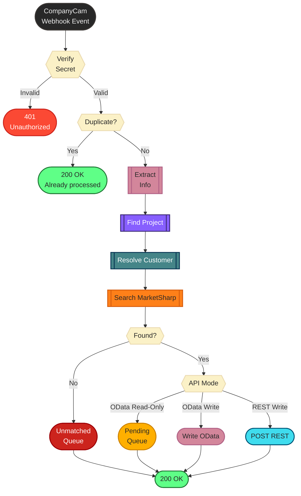
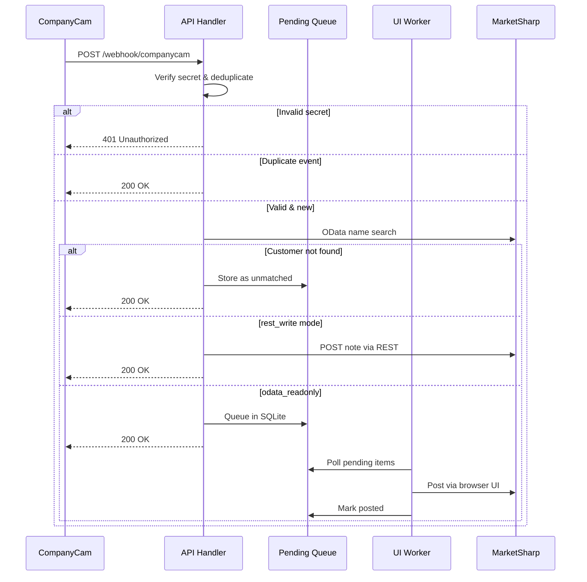
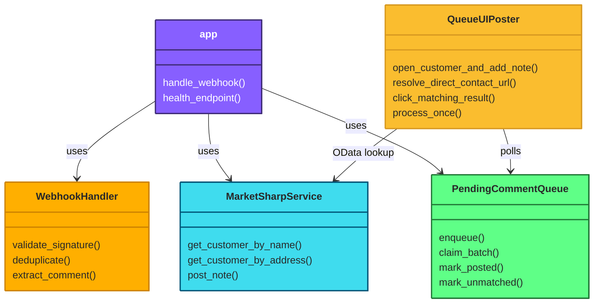

# CompanyCam → MarketSharp Comment Sync

Last updated: 2026-05-26


Webhook-driven integration that receives CompanyCam `comment.*` events and syncs them to the matching customer record in MarketSharp.

Comments are matched by customer name (with address as a tie-breaker), then posted via the configured write path. If a direct API write is unavailable, comments are queued locally and replayed later through a Playwright-driven browser worker that operates against the live MarketSharp web UI.

## Prerequisites

- Python 3.12+
- [pip](https://pip.pypa.io/)
- [Playwright](https://playwright.dev/python/) (required for the UI poster worker)
- Chromium system dependencies (see `playwright install --with-deps chromium`)

## Table of Contents

- [Architecture Overview](#architecture-overview)
- [Quick Start](#quick-start)
- [Configuration](#configuration)
- [How It Works](#how-it-works)
- [Queue UI Poster Worker](#queue-ui-poster-worker)
- [Contact Mapping Workflow](#contact-mapping-workflow)
- [Queue Management Tools](#queue-management-tools)
- [Security Hardening](#security-hardening)
- [API Endpoints](#api-endpoints)
- [Deployment](#deployment)
- [Spicer Submodule Deployment](docs/SPICER_SUBMODULE_DEPLOYMENT.md)
- [Confluence Handoff Report](docs/CONFLUENCE_HANDOFF_REPORT.md)
- [Release Checklist](docs/RELEASE_CHECKLIST.md)
- [CompanyCam Webhook Configuration](#companycam-webhook-configuration)
- [Home Server Deployment Notes](#home-server-deployment-notes)
- [Operations Runbook](#operations-runbook)
- [Troubleshooting](#troubleshooting)
- [Contributing](#contributing)
- [License](#license)

---

## Architecture Overview

CompanyCam delivers `comment.*` events to `/webhook/companycam`. The handler validates the webhook secret, deduplicates via SQLite, resolves the matching MarketSharp customer by name and address, then either posts the note directly or stores it in a local pending queue for the UI worker to replay.

| `MARKETSHARP_MODE` | Description |
| ----------------- | ----------- |
| `auto` (default) | Selects best available write path |
| `rest_write` | Posts notes via MarketSharp REST API in real time |
| `odata_readonly` | No write access — queues comments in SQLite |
| `odata_write` | Writes to MarketSharp `Notes` entity via OData |

---

## API Flowchart


```mermaid
flowchart TD
    A([CompanyCam<br>Webhook Event]):::black
    B{{Verify<br>Secret}}:::white
    Z([401<br>Unauthorized]):::red
    C{{Duplicate?}}:::white
    Z2([200 OK<br>Already processed]):::boldgreen
    D[[Extract<br>Info]]:::magenta
    E[[Find Project]]:::boldpurple
    F[[Resolve Customer]]:::brightblue
    G[[Search MarketSharp]]:::orange
    H{{Found?}}:::white
    I{{API Mode}}:::white
    Q([Unmatched<br>Queue]):::darkred
    Q2([Pending<br>Queue]):::boldorange
    R([Write OData]):::magenta
    S([POST REST]):::boldcyan
    Y([200 OK]):::boldgreen

    A --> B
    B -- "Invalid" --> Z
    B -- "Valid" --> C
    C -- "Yes" --> Z2
    C -- "No" --> D --> E --> F --> G --> H
    H -- "No" --> Q --> Y
    H -- "Yes" --> I
    I -- "OData Read-Only" --> Q2 --> Y
    I -- "OData Write" --> R --> Y
    I -- "REST Write" --> S --> Y

    classDef yellow fill:#fabd2f,stroke:#d79921,stroke-width:2px,color:#282828;
    classDef orange fill:#fe8019,stroke:#d65d0e,stroke-width:2px,color:#282828;
    classDef red fill:#fb4934,stroke:#cc241d,stroke-width:2px,color:#fff;
    classDef darkred fill:#cc241d,stroke:#9d0006,stroke-width:2px,color:#fff;
    classDef green fill:#b8bb26,stroke:#98971a,stroke-width:2px,color:#282828;
    classDef lime fill:#a3be8c,stroke:#5a7f43,stroke-width:2px,color:#282828;
    classDef aqua fill:#8ec07c,stroke:#458588,stroke-width:2px,color:#282828;
    classDef cyan fill:#17aabb,stroke:#076678,stroke-width:2px,color:#282828;
    classDef blue fill:#83a598,stroke:#076678,stroke-width:2px,color:#282828;
    classDef brightblue fill:#458588,stroke:#083553,stroke-width:2px,color:#fff;
    classDef purple fill:#b16286,stroke:#7c3a63,stroke-width:2px,color:#282828;
    classDef magenta fill:#d3869b,stroke:#b16286,stroke-width:2px,color:#282828;
    classDef black fill:#282828,stroke:#3c3836,stroke-width:2px,color:#eee;
    classDef white fill:#fbf1c7,stroke:#ebdbb2,stroke-width:2px,color:#282828;
    classDef boldcyan fill:#3fdcee,stroke:#005577,stroke-width:2px,color:#282828;
    classDef boldorange fill:#ffaf00,stroke:#cc8200,stroke-width:2px,color:#282828;
    classDef boldgreen fill:#5fff87,stroke:#227737,stroke-width:2px,color:#282828;
    classDef boldpurple fill:#875fff,stroke:#3e2b76,stroke-width:2px,color:#fff;
```

## Process Sequencing


```mermaid
sequenceDiagram
    participant CC as CompanyCam
    participant API as API Handler
    participant Q as Pending Queue
    participant W as UI Worker
    participant MS as MarketSharp

    CC->>API: POST /webhook/companycam
    API->>API: Verify secret & deduplicate
    alt Invalid secret
        API-->>CC: 401 Unauthorized
    else Duplicate event
        API-->>CC: 200 OK
    else Valid & new
        API->>MS: OData name search
        alt Customer not found
            API->>Q: Store as unmatched
            API-->>CC: 200 OK
        else rest_write mode
            API->>MS: POST note via REST
            API-->>CC: 200 OK
        else odata_readonly
            API->>Q: Queue in SQLite
            API-->>CC: 200 OK
            W->>Q: Poll pending items
            W->>MS: Post via browser UI
            W->>Q: Mark posted
        end
    end
```

## Class Diagram


```mermaid
classDiagram
    class app {
        handle_webhook()
        health_endpoint()
    }
    class WebhookHandler {
        validate_signature()
        deduplicate()
        extract_comment()
    }
    class MarketSharpService {
        get_customer_by_name()
        get_customer_by_address()
        post_note()
    }
    class PendingCommentQueue {
        enqueue()
        claim_batch()
        mark_posted()
        mark_unmatched()
    }
    class QueueUIPoster {
        open_customer_and_add_note()
        resolve_direct_contact_url()
        click_matching_result()
        process_once()
    }

    app --> WebhookHandler : uses
    app --> MarketSharpService : uses
    app --> PendingCommentQueue : uses
    QueueUIPoster --> PendingCommentQueue : polls
    QueueUIPoster --> MarketSharpService : OData lookup

    class app:::boldpurple
    class WebhookHandler:::boldorange
    class MarketSharpService:::boldcyan
    class PendingCommentQueue:::boldgreen
    class QueueUIPoster:::yellow

    classDef yellow fill:#fabd2f,stroke:#d79921,stroke-width:2px,color:#282828;
    classDef orange fill:#fe8019,stroke:#d65d0e,stroke-width:2px,color:#282828;
    classDef red fill:#fb4934,stroke:#cc241d,stroke-width:2px,color:#fff;
    classDef green fill:#b8bb26,stroke:#98971a,stroke-width:2px,color:#282828;
    classDef blue fill:#83a598,stroke:#076678,stroke-width:2px,color:#282828;
    classDef magenta fill:#d3869b,stroke:#b16286,stroke-width:2px,color:#282828;
    classDef boldcyan fill:#3fdcee,stroke:#005577,stroke-width:2px,color:#282828;
    classDef boldorange fill:#ffaf00,stroke:#cc8200,stroke-width:2px,color:#282828;
    classDef boldgreen fill:#5fff87,stroke:#227737,stroke-width:2px,color:#282828;
    classDef boldpurple fill:#875fff,stroke:#3e2b76,stroke-width:2px,color:#fff;
```

---

## Quick Start

```bash
git clone https://github.com/sweetrellish/api-handlers-spicer.git
cd api-handlers-spicer
pip install -r requirements.txt
cp .env.example .env
# Fill in your secrets in .env
python app.py
```

The application starts on `http://localhost:5001` by default.

## Mention Worker Test Commands

Use these commands from `tagger/` to validate mention notification behavior.

```bash
# 0) Bootstrap local venv and run the worker with any arguments
./run_comment_worker.sh --tag rellis --message "@rellis relay test"

# 1) Dry run (no email send)
python3 comment_worker.py --tag rellis --message "@rellis relay test"

# 2) Send test email via relay
python3 comment_worker.py --send-test-emails --tag rellis --message "@rellis relay test"

# 3) One-pass listen mode for MarketSharp/UI validation
# Post a comment in MarketSharp UI, then run once to process current API payload and exit
python3 comment_worker.py --mode listen --once --poll-seconds 5

# 4) Continuous listen mode (production-like)
python3 comment_worker.py --mode listen --poll-seconds 15

# 5) Local dev seed + one-pass listen using the in-repo /comments feed
./dev_seed_and_listen.sh "@rellis local listener test"
```

Notes:

- `--once` prevents long-running loops during UI validation.
- Duplicate comment IDs are suppressed during a running worker session.
- In test mode, `--tag-all-mapped-users` mentions all users from `tagger/marketsharp_user-email.json` only.

## Production Ops Check

Use the packaged operations check script to validate service health quickly.

```bash
# From repo root (wrapper)
bash ./marketsharp_comment_worker_ops_check.sh

# Direct packaged script
bash ./scripts/marketsharp_comment_worker_ops_check.sh marketsharp_comment_worker.service
```

The check includes:

1. systemd service summary
2. service metadata (active state, restart count, main PID)
3. recent worker journal lines
4. error-pattern scan for the last 24 hours

## UI Poster Mention Formatting

Queue posting uses plain canonical `@username` text.
Wrapper-based note formatting is not part of the base deployment.

```dotenv
MARKETSHARP_NOTE_MENTION_STYLE=plain
```

Current deployment templates pin `MARKETSHARP_NOTE_MENTION_STYLE=plain`.

Why this matters:

1. preserves readable MarketSharp note text without literal wrapper artifacts
2. keeps base mention/tagger parsing behavior stable (`@username` still present)

## Mention Safety Guard Rails

Production mention resolution is now explicit by default to avoid accidental fan-out:

1. only explicit `@username` tokens are eligible recipients
2. plain text words and names are ignored unless explicitly mapped and tagged
3. a per-comment recipient cap blocks unusually broad sends

```dotenv
# default: true (recommended)
# when true, only explicit @mentions are processed
COMMENT_WORKER_REQUIRE_EXPLICIT_MENTIONS=true

# default: 15
# block sending when resolved recipients exceed this count
COMMENT_WORKER_MAX_RECIPIENTS_PER_COMMENT=15

# producer-side guard (queue note normalization path)
# default: true, do not auto-convert standalone words into @mentions
MARKETSHARP_NOTE_REQUIRE_EXPLICIT_MENTIONS=true
```

Ambiguous alias handling remains configurable for explicit mention edge cases:

```dotenv
# all (default): notify all users sharing an explicit ambiguous alias
# skip: ignore ambiguous aliases
COMMENT_WORKER_AMBIGUOUS_ALIAS_MODE=all
```

## Direct MarketSharp Note Monitoring

Base behavior:

1. Polls new MarketSharp notes for mention-notification/tagger flow.
2. Does not attempt note text rewriting.
3. CompanyCam queue poster + mention tagger remain the supported path.

## Git Deployment Handoff

For release readiness and repository handoff steps, see:

- [Production Git Deployment Handoff](docs/PRODUCTION_GIT_DEPLOYMENT_HANDOFF.md)
- [Mention Safety Runbook](docs/MENTION_SAFETY_RUNBOOK.md)

### Server Git Workflow (Clean Worktree)

Use two server checkouts to avoid runtime/cache noise polluting commits:

1. Runtime/API checkout: `/home/rellis/spicer` (branch `main`)
2. Clean commit checkout: `/home/rellis/spicer-clean` (branch `server-clean-main`)

Current setup (already configured):

```bash
ssh rellis@10.8.0.1
cd /home/rellis/spicer
git worktree list
```

Expected output includes both worktrees:

```text
/home/rellis/spicer        ... [main]
/home/rellis/spicer-clean  ... [server-clean-main]
```

Daily commit/push flow (WebUI-friendly):

```bash
ssh rellis@10.8.0.1
cd /home/rellis/spicer-clean
git pull --rebase origin main
# edit/test
git add -p
git commit -m "your change"
git push origin server-clean-main
```

Then open a PR in Git WebUI: `server-clean-main -> main`.

Safety notes:

1. Do not use `/home/rellis/spicer` for regular commits; keep it for running services.
2. Runtime service paths continue to use `/home/rellis/spicer` and are not interrupted by this Git workflow.
3. If you need a fast status view from runtime checkout, filter known cache trees:

```bash
cd /home/rellis/spicer
git status --short -- . \
  ':(exclude)scripts/.marketsharp-profile-worker' \
  ':(exclude)deploy/src/.marketsharp-profile-worker'
```

---

## Configuration

### Environment Variables

Copy `.env.example` to `.env` and fill in your credentials:

```bash
cp .env.example .env
```

| Variable | Required | Description |
| -------- | -------- | ----------- |
| `COMPANYCAM_WEBHOOK_TOKEN` | Yes | CompanyCam access token |
| `COMPANYCAM_WEBHOOK_SECRET` | Yes | Shared secret to validate webhook authenticity |
| `MARKETSHARP_MODE` | No | `auto` (default), `odata_readonly`, `odata_write`, or `rest_write` |
| `MARKETSHARP_COMPANY_ID` | Yes | From MarketSharp API Maintenance page |
| `MARKETSHARP_USER_KEY` | Yes | From MarketSharp API Maintenance page |
| `MARKETSHARP_SECRET_KEY` | Yes | From MarketSharp API Maintenance page |
| `MARKETSHARP_ODATA_URL` | No | Default: `https://api4.marketsharpm.com/WcfDataService.svc` |
| `MARKETSHARP_API_KEY` | `rest_write` only | REST API key |
| `MARKETSHARP_BASE_URL` | `rest_write` only | REST base URL |
| `IDEMPOTENCY_DB_PATH` | No | SQLite file for duplicate prevention |
| `PENDING_QUEUE_DB_PATH` | No | SQLite queue file for deferred comments |
| `MARKETSHARP_UI_*` | Worker only | Browser selectors and settings for the UI poster |
| `MARKETSHARP_UI_CONTACT_URL_MAP_FILE` | No | JSON registry of project-keyed direct contact URLs |

---

## How It Works

1. CompanyCam sends a `comment.*` webhook to `/webhook/companycam`.
2. The handler verifies the shared secret and drops duplicates via SQLite.
3. The comment text, project ID, and author name are extracted from the payload.
4. CompanyCam is queried for the project's address, which is used as a tie-breaker for name matching.
5. MarketSharp is searched via OData by customer name; fuzzy and address-anchored fallbacks apply.
6. The comment is posted immediately (REST/OData write) or queued in `pending_comments.db` for the UI worker.

**Queue item lifecycle:**

```text
pending → processing → posted
                    ↘ unmatched  (name not found after all variants)
                    ↘ true_fail  (retry_count ≥ 4 — needs manual review)
```

---

## Queue UI Poster Worker

When MarketSharp API write access is unavailable, the `queue_ui_poster.py` worker reads `pending_comments.db` and posts each note through the MarketSharp web UI using a persistent Playwright browser session.

### Setup

```bash
pip install -r requirements.txt
python -m playwright install chromium
```

Set the UI worker variables in `.env`:

| Variable | Description |
| -------- | ----------- |
| `MARKETSHARP_UI_BASE_URL` | MarketSharp dashboard URL after login |
| `MARKETSHARP_UI_USER_DATA_DIR` | Browser profile directory (keeps session cookies) |
| `MARKETSHARP_UI_USERNAME` | Auto-login username |
| `MARKETSHARP_UI_PASSWORD` | Auto-login password |
| `MARKETSHARP_UI_NOTES_TAB_SELECTOR` | Selector for the Notes tab |
| `MARKETSHARP_UI_NOTE_BUTTON_SELECTOR` | Selector to open the add-note form |
| `MARKETSHARP_UI_NOTE_INPUT_SELECTOR` | Selector for the note text area |
| `MARKETSHARP_UI_NOTE_SAVE_SELECTOR` | Selector for the save button |
| `MARKETSHARP_UI_CONTACT_URL_MAP_FILE` | JSON mapping file for direct contact URLs |

### Running

The worker is managed by two systemd services:

```bash
sudo systemctl enable --now marketsharp_queue_worker.service
sudo systemctl enable --now marketsharp_queue_worker_event.service
```

Service files are in `deploy/linux/`. To restart both after a code change:

```bash
sudo systemctl restart marketsharp_queue_worker.service marketsharp_queue_worker_event.service
```

Queue worker service startup now uses a launcher script at `src/run_queue_worker.sh` rather than a hard-coded Python path. The launcher picks a usable interpreter in this order:

1. `/home/rellis/spicer/.venv/bin/python`
2. `/home/rellis/spicer/tagger/.venv/bin/python`
3. `python3` from PATH

This avoids systemd `203/EXEC` failures when a stale venv symlink exists.

The worker resolves contacts in this priority order:

1. **Project-keyed URL** from `marketsharp_contact_mappings.json`
2. **Name-keyed URL** from the same mapping file
3. **OData name match** — exact, then fuzzy with address tie-breaker
4. **OData address match** — fallback when name search fails
5. **UI search** — autocomplete-driven browser search across multiple query variants

---

## Contact Mapping Workflow

For contacts where OData search is unreliable, keep a project-keyed URL registry in `marketsharp_contact_mappings.json`:

```json
{
  "project:64476300": "https://www1.marketsharpm.com/ContactDetail.aspx?contactOid=bb34d2c8-77c6-42f9-8521-531f568f37ac&contactType=3",
  "name:eleni stamoulis": "https://www1.marketsharpm.com/ContactDetail.aspx?contactOid=bb34d2c8-77c6-42f9-8521-531f568f37ac&contactType=3"
}
```

```bash
# List queue items with no mapping resolved
python scripts/list_unresolved_projects.py

# Add or update a mapping from a queue item
python scripts/upsert_contact_mapping.py --queue-id 6 \
  --url "https://www1.marketsharpm.com/ContactDetail.aspx?contactOid=...&contactType=3"

# Add by known project id
python scripts/upsert_contact_mapping.py --project-id 64476300 \
  --url "https://www1.marketsharpm.com/ContactDetail.aspx?contactOid=...&contactType=3"
```

---

## Queue Management Tools

| Script | Purpose |
| ------ | ------- |
| `scripts/queue_review_menu.py` | Interactive review, requeue, or delete any queue item |
| `scripts/edit_unmatched_queue_item.py` | Correct a customer name and reset to pending |
| `scripts/delete_queue_items_by_name.py` | Delete queue items by ID or name |
| `scripts/requeue_unmatched.py` | Reset all `unmatched` items to `pending` |
| `scripts/requeue_posted.py` | Reset `posted` items to `pending` for re-push |
| `scripts/posted_comments_audit.py` | Print or export the permanent audit log |
| `review_true_fail.py` | List, review, and requeue `true_fail` items |

### Common CLI usage

```bash
# Correct a misspelled name and requeue
python scripts/edit_unmatched_queue_item.py

# Requeue all unmatched items after fixing a contact in MarketSharp
python scripts/requeue_unmatched.py

# Inspect the queue directly
sqlite3 pending_comments.db \
  "SELECT id, customer_name, status, retry_count FROM pending_comments ORDER BY id DESC LIMIT 20;"
```

`true_fail` items (retry_count ≥ 4) require manual intervention. Common causes:

- Customer name is misspelled in CompanyCam vs MarketSharp → use `edit_unmatched_queue_item.py`
- Contact exists under a different `contactType` (1 or 2 instead of 3) → worker auto-retries types 1 and 2
- Customer genuinely does not exist in MarketSharp → add to mapping file with the correct URL

---

## Deployment Runtime Guards

`deploy/linux/deploy_marketsharp_comment_worker.sh` now includes production runtime sanitation checks on the remote host:

1. Playwright Chromium executable check and automatic install when missing.
2. Orphan browser process cleanup for non-worker Chromium/Playwright descendants.
3. Cloudflared process-count guard.
4. Queue browser process ceiling guard (descendants of active queue worker PID).

Guard tuning via environment variables when launching deploy:

```bash
EXPECTED_CLOUDFLARED_COUNT=1 \
MAX_QUEUE_BROWSER_PROCESSES=12 \
bash ./deploy/linux/deploy_marketsharp_comment_worker.sh
```

If a guard fails, deploy exits non-zero and prints the violating process details.

Additional strict gate (enabled by default):

1. Post-bootstrap queue worker status guard requires:

- `systemctl is-active marketsharp_queue_worker.service == active`
- `ExecMainStatus == 0`

1. If either check fails, deploy exits non-zero and prints recent queue worker logs.
2. To disable this guard temporarily (not recommended for production):

```bash
QUEUE_STATUS_GUARD_REQUIRED=0 bash ./deploy/linux/deploy_marketsharp_comment_worker.sh
```

### Lock-In Baseline Checklist

After deploy/reload, run the following on the server and save output for
regression diffing:

```bash
systemctl is-active marketsharp_comment_worker.service
systemctl is-active marketsharp_queue_worker.service
systemctl is-active marketsharp_queue_worker_event.service
systemctl is-active spicer-flask-api.service
systemctl is-active spicer-webhook-sync.timer
systemctl is-active spicer-webhook-sync.service

systemctl show marketsharp_queue_worker.service -p ExecStart -p ExecMainStatus -p ActiveState -p SubState --no-pager
systemctl show spicer-webhook-sync.service -p Result -p ExecMainStatus -p ActiveState -p SubState --no-pager

journalctl -u marketsharp_queue_worker.service -n 25 --no-pager
journalctl -u spicer-webhook-sync.service -n 25 --no-pager

systemctl --failed --no-pager
```

---

## Security Hardening

- Webhook requests are verified using HMAC with `COMPANYCAM_WEBHOOK_SECRET`
- Duplicate events are dropped via a SQLite idempotency store
- Invalid webhook requests return `401 Unauthorized`
- Duplicate deliveries return `200 OK` to stop CompanyCam retry loops
- Secrets live only in `.env` on the target host and are never committed

---

## API Endpoints

### `POST /webhook/companycam`

Receives events from CompanyCam. Typical responses:

| Status | Meaning |
| ------ | ------- |
| `200 OK` | Accepted, deduplicated, queued, or posted |
| `401 Unauthorized` | Secret/token validation failed |
| `400 Bad Request` | Malformed or unprocessable payload |
| `500 Internal Server Error` | Unexpected application error |

### `GET /health`

```bash
curl -sS http://127.0.0.1:5001/health
```

### `POST /test`

Verifies the handler path with a sample comment event. Keep this endpoint behind your normal network controls in production.

---

## Deployment

### Gunicorn (production)

```bash
gunicorn -w 4 -b 0.0.0.0:5001 app:app
```

Settings live in `gunicorn.conf.py`.

### Docker

```bash
docker build -t companycam-marketsharp-sync .
docker run -p 5001:5001 --env-file .env companycam-marketsharp-sync
```

### systemd service example

```ini
[Unit]
Description=CompanyCam → MarketSharp Webhook Service
After=network.target

[Service]
User=rellis
WorkingDirectory=/home/rellis/spicer/src
EnvironmentFile=/home/rellis/spicer/src/.env
ExecStart=/home/rellis/spicer/.venv/bin/gunicorn -w 4 -b 0.0.0.0:5001 app:app
Restart=always
RestartSec=5

[Install]
WantedBy=multi-user.target
```

Service definitions for the webhook, both queue workers, and the true-fail checker are in `deploy/linux/`.

### nginx reverse proxy

```nginx
server {
    listen 443 ssl;
    server_name your-domain.example;

    location / {
        proxy_pass http://127.0.0.1:5001;
        proxy_set_header Host $host;
        proxy_set_header X-Real-IP $remote_addr;
        proxy_set_header X-Forwarded-For $proxy_add_x_forwarded_for;
        proxy_set_header X-Forwarded-Proto $scheme;
    }
}
```

### rsync deploy

```bash
rsync -avz --delete \
  --exclude ".env" \
  --exclude ".venv" \
  --exclude "__pycache__" \
  --exclude "*.pyc" \
  /path/to/spicer/ rellis@your-server:/home/rellis/spicer/src/
```

---

## CompanyCam Webhook Configuration

In CompanyCam, set:

- **URL**: `https://your-domain.com/webhook/companycam`
- **Event**: `comment.*`
- **Token**: value of `COMPANYCAM_WEBHOOK_SECRET`

### cURL setup

```bash
set -a; source .env; set +a
export WEBHOOK_URL="https://your-domain.com/webhook/companycam"

# List existing webhooks
curl --request GET \
  --url https://api.companycam.com/v2/webhooks \
  --header "accept: application/json" \
  --header "authorization: Bearer $COMPANYCAM_WEBHOOK_TOKEN"

# Create webhook
curl --request POST \
  --url https://api.companycam.com/v2/webhooks \
  --header "accept: application/json" \
  --header "content-type: application/json" \
  --header "authorization: Bearer $COMPANYCAM_WEBHOOK_TOKEN" \
  --data "{\"url\":\"$WEBHOOK_URL\",\"scopes\":[\"comment.*\"],\"enabled\":true,\"token\":\"$COMPANYCAM_WEBHOOK_SECRET\"}"

# Delete a stale webhook
curl --request DELETE \
  --url https://api.companycam.com/v2/webhooks/<WEBHOOK_ID> \
  --header "accept: application/json" \
  --header "authorization: Bearer $COMPANYCAM_WEBHOOK_TOKEN"
```

---

## Home Server Deployment Notes

- Keep `.env` only on the server — never commit it. Use `.env.example` as the template.
- Run under systemd so webhook handling survives reboots (units in `deploy/linux/`).
- Place nginx or Caddy in front for TLS termination, reverse-proxying to port `5001`.
- Use a named Cloudflare tunnel for a stable public HTTPS URL:

```bash
cloudflared tunnel login
cloudflared tunnel create spicer-webhook
# Copy deploy/cloudflared/config.example.yml, fill in tunnel UUID and hostname, then:
cloudflared tunnel run spicer-webhook
```

Set the CompanyCam webhook URL to `https://webhook.yourdomain.com/webhook/companycam`.

### One-command deploy

```bash
./scripts/deploy_to_scoup2025sucoscrack.sh
```

---

## Operations Runbook

### Human Rollout Playbook (All Modules)

Use this playbook to keep rollouts human-friendly and consistent across API, workers, deploy units, and scripts.

```bash
# Run from repo root on the server clone
./scripts/rollout_one_command.sh --message "ops: targeted rollout" --drop-stash
```

What this does:

1. Stashes unrelated drift.
2. Restores only approved paths from `scripts/ship-files.default.txt`.
3. Stages changed files only.
4. Commits and pushes `main`.
5. Verifies these services are active:

- `spicer-flask-api.service`
- `marketsharp_queue_worker.service`
- `marketsharp_comment_worker.service`

No further action is required when the script completes successfully and service checks return `active`.

If you need a custom file list for one rollout, pass `--files <path>` and keep the list repo-relative.

### Health check

```bash
curl -sS http://127.0.0.1:5001/health

# Verify the CompanyCam webhook is registered
set -a; source .env; set +a
curl --request GET \
  --url https://api.companycam.com/v2/webhooks \
  --header "accept: application/json" \
  --header "authorization: Bearer $COMPANYCAM_WEBHOOK_TOKEN"
```

### Queue status

```bash
sqlite3 pending_comments.db \
  "SELECT status, COUNT(*) FROM pending_comments GROUP BY status;"
```

### Worker logs

```bash
journalctl -u marketsharp_queue_worker.service \
           -u marketsharp_queue_worker_event.service \
           --since "10 minutes ago" --no-pager
```

### True-fail review

The `true_fail_checker` timer (in `deploy/linux/`) logs a warning when any `true_fail` items accumulate.

```bash
# List and interactively requeue
python review_true_fail.py --list
python review_true_fail.py --requeue 508,509,510

# Correct a customer name, then the worker picks it up automatically
python scripts/edit_unmatched_queue_item.py
```

### Recover stale processing items

If the worker was killed mid-run, items stuck in `processing` are automatically recovered after ~30 seconds on the next worker tick. You can also reset them manually:

```bash
sqlite3 pending_comments.db \
  "UPDATE pending_comments SET status='pending' WHERE status='processing';"
```

---

## Troubleshooting

- Check worker logs first: `journalctl -u marketsharp_queue_worker.service -f`
- Use `/test` to verify the webhook handler path is reachable.
- Confirm API keys in `.env` have the necessary MarketSharp permissions.
- Customer names that differ slightly between CompanyCam and MarketSharp are handled by fuzzy matching; if a contact still fails, use `edit_unmatched_queue_item.py` to correct the name.
- In `odata_readonly` mode, `pending` items are expected until the UI worker posts them.
- If the autocomplete search never fires in the UI worker, verify `MARKETSHARP_UI_BASE_URL` resolves to the correct domain (`www1.marketsharpm.com` after login).
- Contacts under a non-default `contactType` (1 or 2 instead of 3) are auto-retried by the worker.

---

## Contributing

Pull requests are welcome. Open an [issue](https://github.com/sweetrellish/api-handlers-spicer/issues) first for bugs or larger changes so implementation details can be discussed.

For local development:

```bash
pip install -r requirements.txt
cp .env.example .env
python app.py
```

Update the README and operational scripts in the same change when integration behavior changes.

---

## License

This project is licensed under the MIT License. See the [LICENSE](LICENSE) file for details.
